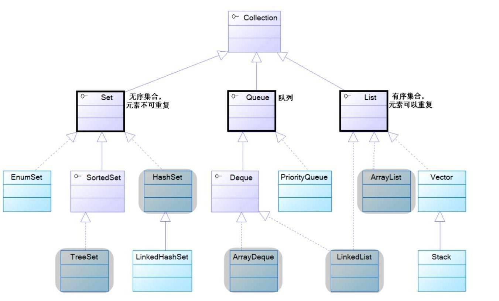
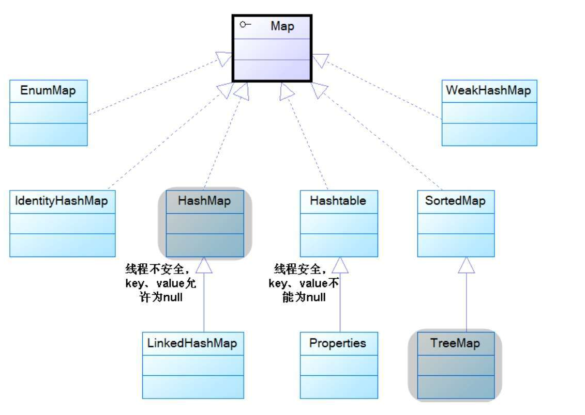
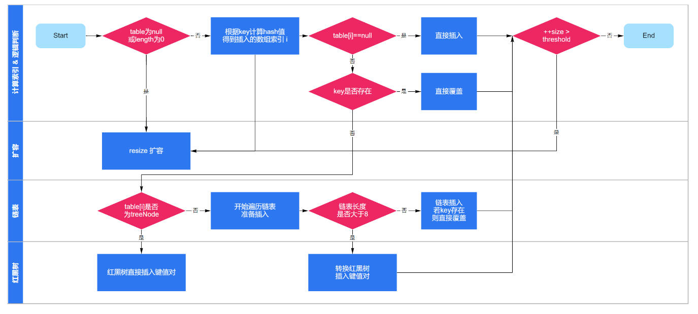

# Java中的集合
集合类主要是由Collection和Map这两个接口派生的，其中Collection派生出三个子接口Set、List、Queue。所有集合类都是set、list、queue、map这四个接口的实现类
+ Set代表无序的，元素不可重复的集合；
+ List代表有序，元素可以重复的集合；
+ Queue代表先进先出的队列；
+ Map代表具有映射关系（key-value）的集合。  
collection体系的继承树
   
map体系的继承树  
  

# Java中的容器，线程安全和线程不安全的分别有哪些？
+ 线程不安全：HashSet、TreeSet、ArrayList、LinkedList、ArrayDeque、HashMap、TreeMap,优点是性能好，如果需要使用线程安全的集合类，可以使用collections工具类提供的synchronizedXxx()方法，将这些集合类包装成线程安全的集合类。
+ 线程安全：Vector、Hashtable。这些集合类都是比较古老的API，虽然实现了线程安全，但是性能较差  

# Map接口有些实现类？
常见：HashMap、LinkedHashMap、TreeMap、ConcurrentHashMap  
优先考虑使用HashMap，是性能最好的Map实现类。如果需要保证线程安全，则可以使用ConcurrentHashMap。  
如果需要排序，则可以使用LinkedHashMap。  

# 描述Map put的过程
1. 首次扩容：先判断数组是否为空，若数组为空则进行第一次扩容(resize).
2. 计算索引：通过hash算法，计算键值对在数组中的索引；
3. 插入数据：
+ 如果当前位置的元素为空，则直接插入数据；
+ 如果当前位置的元素非空，且key已存在，则直接覆盖其value
+ 如果当前位置的元素非空，且key不存在，则将数据链到链表的末端；
+ 若链表长度打到8，则将链表转换为红黑树，并将数据插入树中
4. 再次扩容：如果数组中远古三的个数(size)超过threshold，则再次进行扩容操作
  

# Java7和Java8中的HashMap
JDK7中的HashMap，基于数组+链表来实现，他的底层维护一个Entry数组，会根据计算的hashCode将对应的kV键值储存到该数组中，一旦hashcode冲突，就会将该KV键值对放到对应已有元素的后哦面，此时便形成一个链表式的存储结构。有一个明显的缺点，即当hash冲突严重时，形成的链表会变得越来越长，这样在查询时的效率就会越来越低，时间复杂度为O(N)  
JDK8中的HashMap，基于数组+链表+红黑树来实现，他的底层维护一个Node数组。当链表的存储的数据个数大于等于8的时候，不在采用链表存储，而采用红黑树存储结构。主要是在查询的时间复杂度上进行优化，链表为O(N),而红黑树一直是O(logN),大大提高了查找性能。

# HashMap底层的实现原理
基于hash算法，通过put方法和get方法存储和获取对象。  
存储对象时，我们将K/V传给put方法时，他调用K的hashcode计算hash从而得到bucket位置，进一步存储，HashMap会根据当前bucket的占用情况自动调整容量。获取对象时，我们将K传给get，他调用hashcode计算hash从而得到bucket位置，并进一步调用equals()方法确定键值对。  

# HashMap和HashTable的区别
1.hashtable是一个线程安全的Map实现，但HashMap是线程不安全的实现，所以HashMap比Hashtable的性能高一点  
2.Hashtable不允许使用null作为key和value，如果将null放入hashtable中，会引发空指针异常，但HashMap则可以。

# LinkedHashMap
LinkedHashMap使用双向链表来维护key-value对的顺序（其实只需要考虑key的顺序），该链表负责维护Map的迭代顺序，迭代顺序与key-value对的插入顺序保持一致。

LinkedHashMap可以避免对HashMap、Hashtable里的key-value对进行排序（只要插入key-value对时保持顺序即可），同时又可避免使用TreeMap所增加的成本。

LinkedHashMap需要维护元素的插入顺序，因此性能略低于HashMap的性能。但因为它以链表来维护内部顺序，所以在迭代访问Map里的全部元素时将有较好的性能。  

# LinkedHashMap的底层原理
LinkedHashMap继承于HashMap，它在HashMap的基础上，通过维护一条双向链表，解决了HashMap不能随时保持遍历顺序和插入顺序一致的问题。在实现上，LinkedHashMap很多方法直接继承自HashMap，仅为维护双向链表重写了部分方法。
