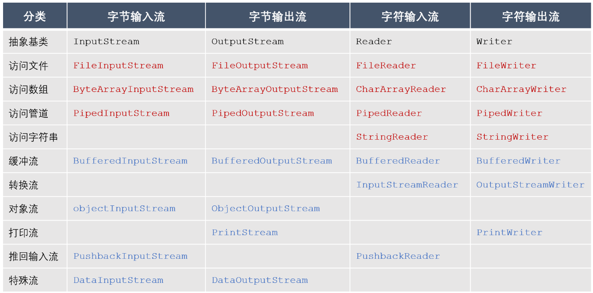

# Java中的IO流
用于实现对数据的输入与输出操作，不同的输入/输出源（键盘、文件、网络等）抽象表述为流（Stream）
+ 按照数据流向，可以分为输入流和输出流，其中输入流只能读取数据、不能写入数据，而输出流只能写入数据、不能读取数据。
+ 按照数据类型，可以分为字节流和字符流，其中字节流操作的数据单元是8位的字节，而字符流操作的数据单元是16位的字符
+ 按照处理功能，可以分为节点流和处理流，其中节点流可以直接从一个特定的IO设备读写数据，位称为低级流，而处理流是对节点流的连接或封装，用于简化数据读写功能或提高效率，也称为高级流。  
